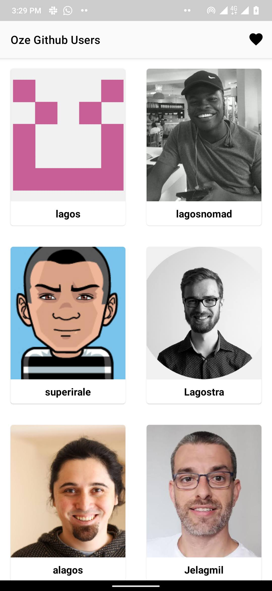
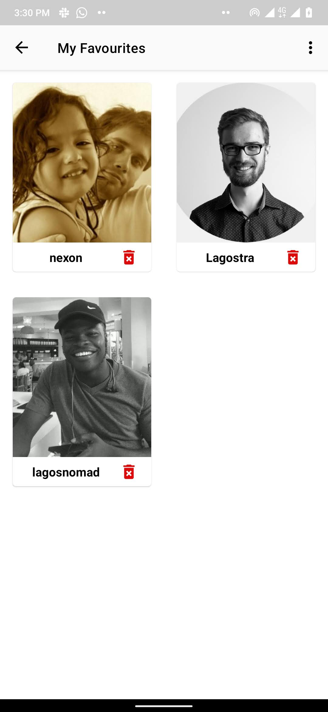
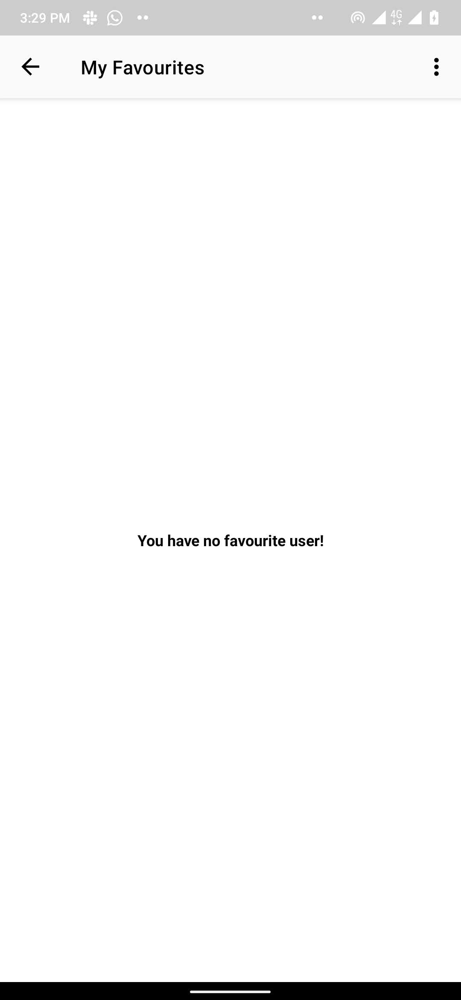
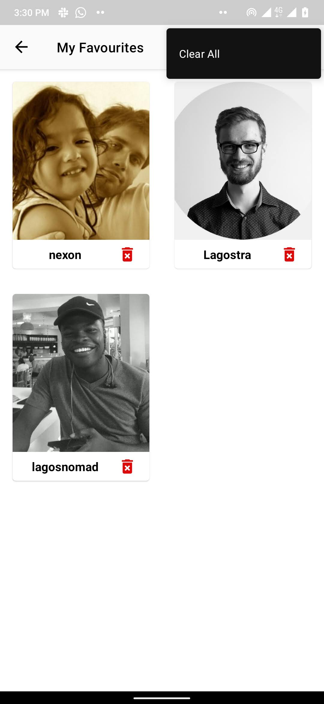
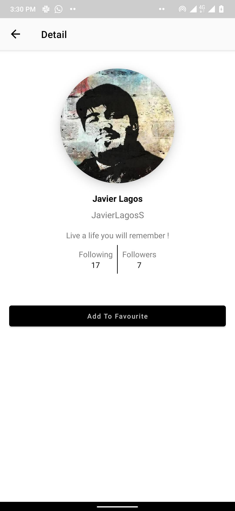
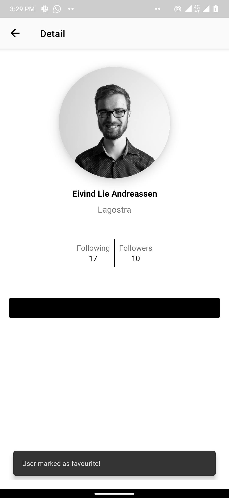
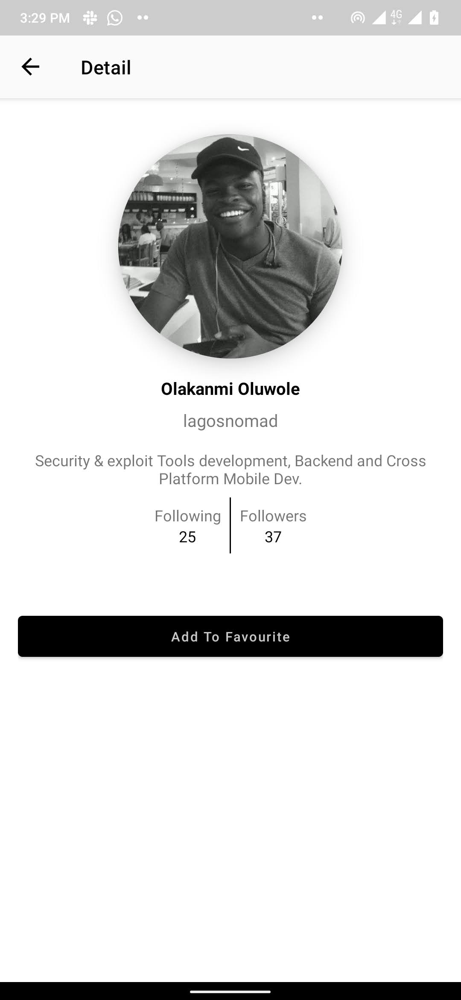
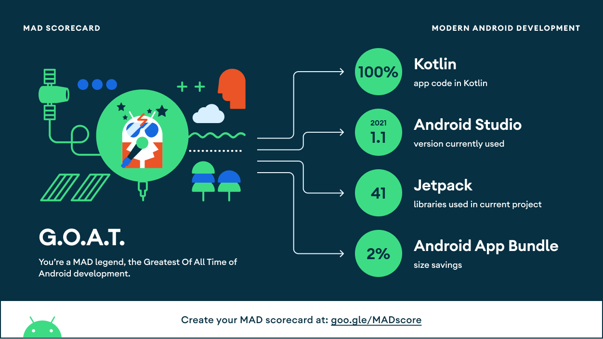

# :waxing_gibbous_moon: Oze Senior Android Engineer Assignment

# :scroll: Assignment instructions

Implement “Github” user’s api for Lagos developers
https://api.github.com/search/users?q=lagos&page=1 (GET)
➔ See list of users with profile pictures ➔ See default avatar if there is no profile picture ➔ Click on a profile and see more details about the profile ➔ See more pages/profiles as the user scrolls towards the end ➔ Mark profile as favorite and view from local db (Room)
➔ Remove single profile from favorite or clear all

To learn more about Github API and Implementations
https://docs.github.com/en/rest/guides/getting-started-with-the-rest-api

# :question: Tech Requirements

❖ Strictly MVVM ❖ Strictly Kotlin ❖ Dagger or Hilt ❖ Strictly RxJava ❖ Retrofit ❖ Jetpack Paging ❖ Modularization and unit test is a plus

# :scroll: Description

This assignment solution is implemented with MVVM

It is written 100% in Kotlin with both unit and integrated tests.🙂

  
  
  

  
  
  
  

## Installation

* To run this code, clone this repository using this command `git clone https://github.com/chydee/Oze-Senior-Android-Engineer-Assignment.git`
* Import into android studio
* Build the project and run on an android device or emulator

## Architecture

The architecture of the project follows the principles of DRY and MVVM.

  

## :thought_balloon: What I could have done better in attempting this test

- Handle error messages properly with more contexts
- Test end to end.
- Persist room data so I can reduce the number of network calls made.

...but there's more from where this came.